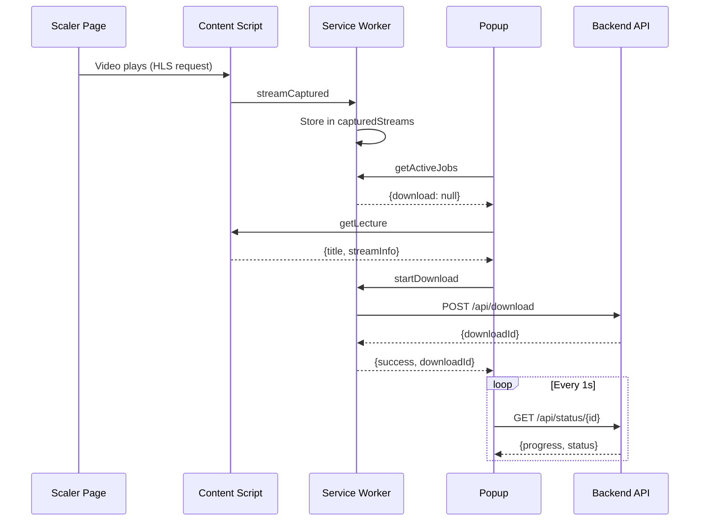

# Scaler Companion - Chrome Extension Documentation

## 1. Overview

The Chrome Extension is a Manifest V3 extension that:
1. Captures HLS stream URLs from Scaler Academy
2. Intercepts CloudFront authentication tokens
3. Provides UI for initiating downloads
4. Communicates with the local backend server

---

## 2. File Structure

```
extension/
├── manifest.json           # Extension manifest (MV3)
├── popup/
│   ├── popup.html          # Popup UI structure
│   ├── popup.js            # Popup logic
│   └── popup.css           # Popup styles
├── content/
│   ├── inject.js           # Content script (stream capture)
│   └── inject.css          # Injected styles
├── background/
│   └── service-worker.js   # Background service worker
└── icons/
    ├── icon16.png
    ├── icon32.png
    ├── icon48.png
    └── icon128.png
```

---

## 3. Manifest Configuration

```json
{
  "manifest_version": 3,
  "name": "Scaler Companion",
  "version": "1.0.0",
  "permissions": ["activeTab", "storage", "downloads"],
  "host_permissions": [
    "https://*.scaler.com/*",
    "https://media.scaler.com/*",
    "http://localhost:8000/*"
  ],
  "content_scripts": [{
    "matches": ["https://*.scaler.com/*"],
    "js": ["content/inject.js"],
    "css": ["content/inject.css"]
  }],
  "background": {
    "service_worker": "background/service-worker.js",
    "type": "module"
  }
}
```

---

## 4. Content Script (`inject.js`)

### 4.1 State Management

```javascript
let currentLecture = null;       // Current page lecture info
let capturedStreamInfo = null;   // Captured HLS stream data
let currentUrl = location.href;  // For SPA navigation detection
let capturedUrls = new Set();    // Prevent duplicate captures
```

### 4.2 Stream URL Capture

**Intercepted Patterns:**
- `m3u8` → Master playlist (variant selector)
- `_segment/` → Actual video segments
- `.ts` files → Individual chunks

```javascript
// Intercept fetch()
const originalFetch = window.fetch;
window.fetch = async function(...args) {
  const url = args[0]?.url || args[0];
  if (shouldCapture(url)) {
    captureStreamUrl(url);
  }
  return originalFetch.apply(this, args);
};

// Intercept XMLHttpRequest
const originalXHROpen = XMLHttpRequest.prototype.open;
XMLHttpRequest.prototype.open = function(method, url, ...rest) {
  if (shouldCapture(url)) {
    captureStreamUrl(url);
  }
  return originalXHROpen.apply(this, [method, url, ...rest]);
};
```

### 4.3 CloudFront Auth Extraction

```javascript
function captureSegmentUrl(url) {
  // Parse URL for auth params
  const urlObj = new URL(url);
  const keyPairId = urlObj.searchParams.get('Key-Pair-Id');
  const policy = urlObj.searchParams.get('Policy');
  const signature = urlObj.searchParams.get('Signature');
  
  // Extract chunk number from URL
  // Pattern: data000025.ts or 000025.ts
  const chunkMatch = url.match(/data?(\d+)\.ts/);
  const chunkNum = chunkMatch ? parseInt(chunkMatch[1]) : null;
  
  // Build base URL (strip chunk + auth)
  const baseUrl = url.split(/data?\d+\.ts/)[0];
  
  capturedStreamInfo = {
    baseUrl,
    keyPairId,
    policy,
    signature,
    detectedChunk: chunkNum
  };
  
  // Notify service worker
  chrome.runtime.sendMessage({
    action: 'streamCaptured',
    data: capturedStreamInfo
  });
}
```

### 4.4 SPA Navigation Handling

Scaler uses React Router (SPA), so normal page loads don't trigger content script re-injection.

```javascript
// Monitor history changes
const originalPushState = history.pushState;
history.pushState = function(...args) {
  const result = originalPushState.apply(this, args);
  checkUrlChange();
  return result;
};

window.addEventListener('popstate', checkUrlChange);

function checkUrlChange() {
  const newUrl = location.href;
  if (getClassId(newUrl) !== getClassId(currentUrl)) {
    // New lecture - reset state
    resetStreamState();
  }
  currentUrl = newUrl;
}

function resetStreamState() {
  capturedStreamInfo = null;
  capturedUrls.clear();
}
```

### 4.5 Lecture Detection

```javascript
function detectLecture() {
  // 1. Extract title from page
  const title = document.querySelector('[class*="class-title"]')?.textContent
             || document.querySelector('h1')?.textContent;
  
  // 2. Detect session type
  const isRecorded = !!document.querySelector('[class*="recording"]');
  const isLive = !!document.querySelector('[class*="live-"]');
  
  // 3. Get duration if available
  const durationEl = document.querySelector('[class*="duration"]');
  
  return {
    title,
    url: location.href,
    isRecorded,
    isLive,
    duration: parseDuration(durationEl?.textContent),
    streamInfo: capturedStreamInfo
  };
}
```

---

## 5. Service Worker (`service-worker.js`)

### 5.1 State

```javascript
const capturedStreams = new Map();  // tabId → streamInfo
const activeJobs = {
  download: null,    // { id, title, progress, status }
  processing: null   // { id, title, progress, stage, status }
};
```

### 5.2 Message Handlers

| Message | Handler | Purpose |
|---------|---------|---------|
| `streamCaptured` | Store per tab | Save stream data |
| `authCaptured` | Merge with stream | Add auth tokens |
| `getLecture` | Return stored | Popup requests lecture |
| `startDownload` | Call API | Initiate download |
| `getActiveJobs` | Return state | Popup checks progress |
| `pageNavigated` | Clear tab data | Reset on new lecture |

```javascript
chrome.runtime.onMessage.addListener((message, sender, sendResponse) => {
  switch (message.action) {
    case 'startDownload':
      handleStartDownload(message, sendResponse);
      return true; // Async response
    
    case 'getActiveJobs':
      sendResponse(activeJobs);
      return false;
  }
});
```

### 5.3 Download Handling

```javascript
async function handleStartDownload(message, sendResponse) {
  const { lecture } = message;
  
  try {
    // Call backend API
    const response = await fetch('http://localhost:8000/api/download', {
      method: 'POST',
      headers: { 'Content-Type': 'application/json' },
      body: JSON.stringify({
        title: lecture.title,
        url: lecture.url,
        streamInfo: lecture.streamInfo,
        startTime: lecture.startTime,
        endTime: lecture.endTime
      })
    });
    
    const { downloadId } = await response.json();
    
    activeJobs.download = {
      id: downloadId,
      title: lecture.title,
      status: 'downloading',
      progress: 0
    };
    
    startPolling();
    sendResponse({ success: true, downloadId });
    
  } catch (error) {
    sendResponse({ success: false, error: error.message });
  }
}
```

### 5.4 Progress Polling

```javascript
let pollInterval = null;

function startPolling() {
  if (pollInterval) return;
  
  pollInterval = setInterval(async () => {
    // Poll download status
    if (activeJobs.download?.id) {
      const status = await fetchStatus('api/status', activeJobs.download.id);
      activeJobs.download = { ...activeJobs.download, ...status };
      
      if (status.status === 'complete' || status.status === 'error') {
        activeJobs.download = null;
      }
    }
    
    // Stop polling if no active jobs
    if (!activeJobs.download && !activeJobs.processing) {
      clearInterval(pollInterval);
      pollInterval = null;
    }
  }, 1000);
}
```

---

## 6. Popup (`popup.js`)

### 6.1 UI States

| State | Shows | Actions Available |
|-------|-------|-------------------|
| Offline | Banner | Retry |
| No Lecture | Empty state | - |
| Lecture Ready | Title + Download | Download, Open Dashboard |
| Downloading | Progress | Cancel (future) |
| Complete | Success | Open Dashboard |
| Error | Error message | Retry |

### 6.2 Initialization Flow

```javascript
document.addEventListener('DOMContentLoaded', async () => {
  // 1. Check backend health
  await checkBackendHealth();
  
  // 2. Check for active jobs (persistent)
  await checkActiveJobs();
  
  // 3. Detect lecture on current page
  await detectLecture();
});
```

### 6.3 Lecture Detection

```javascript
async function detectLecture() {
  const [tab] = await chrome.tabs.query({
    active: true,
    currentWindow: true
  });
  
  // Request lecture info from content script
  chrome.tabs.sendMessage(tab.id, { action: 'getLecture' }, (response) => {
    if (response?.lecture) {
      showLecture(response.lecture);
    } else {
      showNoLecture();
    }
  });
}
```

### 6.4 Download Initiation

```javascript
async function handleDownload() {
  // Validate
  if (!currentLecture?.streamInfo?.baseUrl) {
    showError('Play the video first to capture stream');
    return;
  }
  
  // Get time range (if specified)
  const startTime = parseTime(elements.startTimeInput?.value);
  const endTime = parseTime(elements.endTimeInput?.value);
  
  // Send to service worker
  chrome.runtime.sendMessage({
    action: 'startDownload',
    lecture: {
      ...currentLecture,
      startTime,
      endTime
    }
  }, (response) => {
    if (response.success) {
      startProgressPolling(response.downloadId);
    } else {
      showError(response.error);
    }
  });
}
```

---

## 7. Message Flow Diagram



---

## 8. Error Handling

### 8.1 Network Errors

```javascript
async function checkBackendHealth() {
  try {
    const response = await fetch(`${BACKEND_URL}/health`, {
      signal: AbortSignal.timeout(5000)
    });
    setBackendOnline(response.ok);
  } catch (error) {
    setBackendOnline(false);
  }
}
```

### 8.2 Missing Stream Data

```javascript
function validateStreamInfo(streamInfo) {
  const required = ['baseUrl', 'keyPairId', 'policy', 'signature'];
  const missing = required.filter(key => !streamInfo?.[key]);
  
  if (missing.length > 0) {
    return { valid: false, error: `Missing: ${missing.join(', ')}` };
  }
  return { valid: true };
}
```

---

## 9. Development Tips

### 9.1 Reload Extension

```javascript
// In popup console
chrome.runtime.reload();
```

### 9.2 Debug Service Worker

1. Go to `chrome://extensions/`
2. Click "Service Worker" link under Scaler Companion
3. Opens DevTools for background script

### 9.3 Debug Content Script

1. Open DevTools on Scaler page
2. Sources → Content Scripts → inject.js

---

*Document Version: 1.0 | Last Updated: 2026-01-14*
