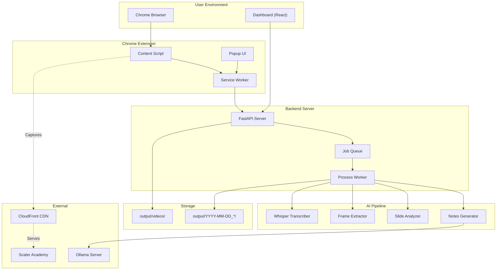
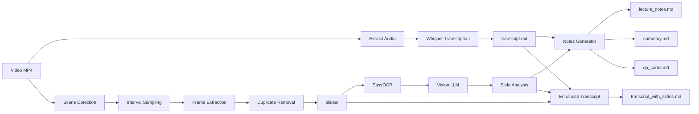
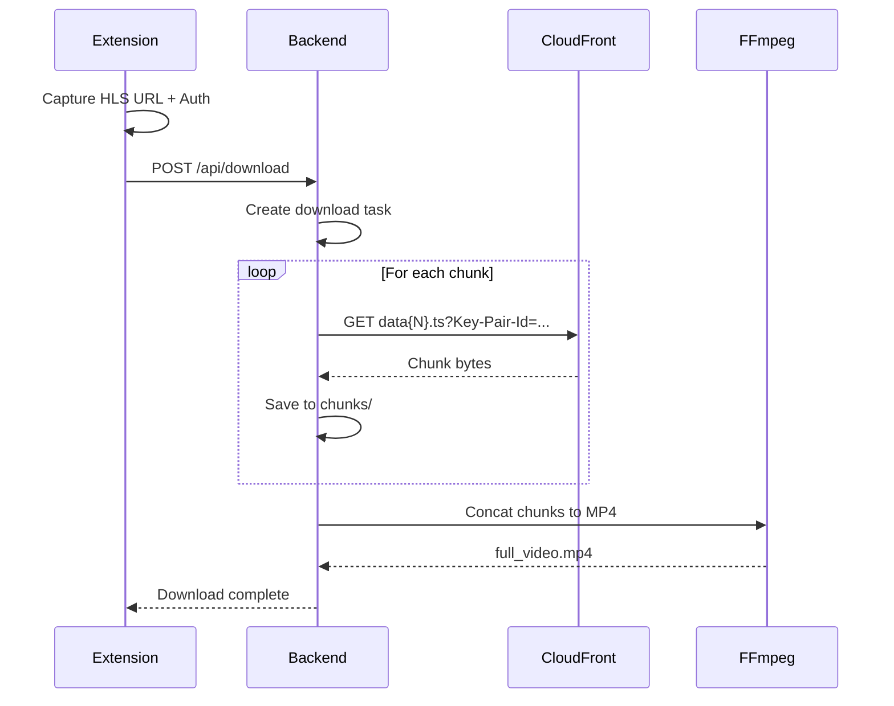
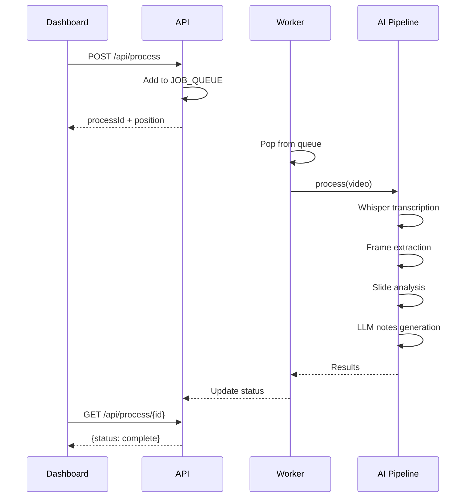
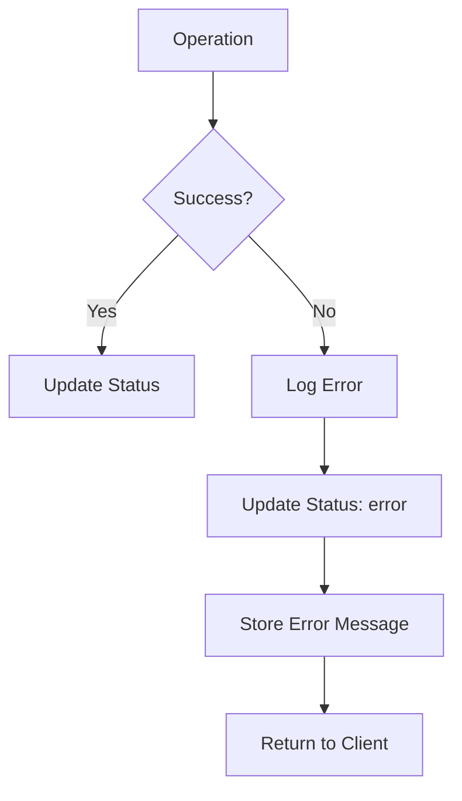

# Scaler Companion - High Level Design (HLD)

## 1. System Overview



---

## 2. Component Architecture

### 2.1 Chrome Extension (MV3)

| Component | File | Responsibility |
|-----------|------|----------------|
| **Popup** | `popup/popup.{html,js,css}` | User interface for downloads |
| **Content Script** | `content/inject.js` | Stream URL capture, page injection |
| **Service Worker** | `background/service-worker.js` | Message passing, persistent state |

**Key Features:**
- Intercepts `fetch()` and `XMLHttpRequest` to capture HLS URLs
- Handles SPA navigation (pushState/replaceState monitoring)
- Validates CloudFront signed URLs
- Detects session type (live vs recorded)

---

### 2.2 Backend Server

```
backend/
├── server.py           # FastAPI app, routes, background tasks
├── downloader.py       # HLS chunk download, FFmpeg merge
├── pipeline.py         # Orchestrates full processing workflow
├── transcriber.py      # Whisper speech-to-text
├── frame_extractor.py  # Scene detection + interval extraction
├── slide_analyzer.py   # OCR + Vision LLM analysis
├── notes_generator.py  # Ollama LLM prompt management
└── m3u8_parser.py      # HLS manifest parsing
```

**Server Architecture:**
- **Async API Layer:** FastAPI with CORS for extension/dashboard access
- **Background Workers:** Async task queue for sequential processing
- **State Management:** In-memory dicts for download/process status
- **Static Serving:** Mounted `/content` for artifact access

---

### 2.3 Dashboard (React SPA)

```
dashboard/src/
├── App.jsx             # Router, layout, navigation
├── pages/
│   ├── HomePage.jsx    # Recording library grid
│   ├── QueuePage.jsx   # Processing queue status
│   └── RecordingPage.jsx # Individual recording viewer
├── components/
│   └── FlashcardViewer.jsx # Interactive Q&A cards
└── index.css           # Tailwind + custom styles
```

**Routes:**
| Path | Component | Purpose |
|------|-----------|---------|
| `/` | HomePage | Browse all recordings |
| `/queue` | QueuePage | View processing queue |
| `/recording/:id` | RecordingPage | View specific recording |

---

### 2.4 AI Pipeline



---

## 3. Data Flow

### 3.1 Download Flow



### 3.2 Processing Flow



---

## 4. Technology Stack

| Layer | Technology | Version | Purpose |
|-------|------------|---------|---------|
| **Extension** | Chrome MV3 | - | Browser integration |
| **Frontend** | React | 18.x | Dashboard UI |
| **Build** | Vite | 5.x | Fast bundling |
| **Styling** | Tailwind CSS | 4.x | Utility-first CSS |
| **Backend** | FastAPI | 0.104+ | Async API server |
| **Runtime** | Python | 3.10+ | Backend runtime |
| **Transcription** | OpenAI Whisper | 20231117 | Speech-to-text |
| **LLM** | Ollama | 0.1+ | Local LLM inference |
| **OCR** | EasyOCR | 1.7+ | Text extraction |
| **Video** | FFmpeg | latest | Video processing |
| **Hashing** | imagehash | 4.3+ | Perceptual hashing |

---

## 5. Deployment Architecture

```
┌─────────────────────────────────────────────────────────────┐
│                     User's Machine (macOS)                   │
├─────────────────────────────────────────────────────────────┤
│  ┌─────────────┐  ┌─────────────┐  ┌─────────────────────┐  │
│  │   Chrome    │  │  Dashboard  │  │   Ollama Server     │  │
│  │ + Extension │  │  :5173      │  │   :11434            │  │
│  └─────────────┘  └─────────────┘  └─────────────────────┘  │
│         │               │                    │              │
│         └───────────────┼────────────────────┘              │
│                         │                                    │
│                         ▼                                    │
│                ┌─────────────────┐                          │
│                │  FastAPI Server │                          │
│                │     :8000       │                          │
│                └─────────────────┘                          │
│                         │                                    │
│         ┌───────────────┼───────────────┐                   │
│         ▼               ▼               ▼                   │
│  ┌───────────┐  ┌───────────┐  ┌───────────────────┐       │
│  │  Whisper  │  │  FFmpeg   │  │  Caffeinate       │       │
│  │  (GPU/CPU)│  │           │  │  (Sleep prevent)  │       │
│  └───────────┘  └───────────┘  └───────────────────┘       │
│                                                              │
│  ┌─────────────────────────────────────────────────────────┐│
│  │                    File System                          ││
│  │  output/                                                 ││
│  │  ├── videos/{title}/full_video.mp4                      ││
│  │  └── YYYY-MM-DD_{title}/                                ││
│  │      ├── lecture_notes.md, summary.md, ...              ││
│  │      └── slides/*.png                                   ││
│  └─────────────────────────────────────────────────────────┘│
└─────────────────────────────────────────────────────────────┘
```

---

## 6. Security Considerations

| Concern | Current Handling |
|---------|------------------|
| **Auth Tokens** | Captured from network, never stored persistently |
| **CORS** | Open (`*`) - localhost only deployment |
| **File Access** | Scoped to output directory |
| **API Auth** | None (local-only design) |

**V2 Considerations:**
- Add API key for remote access scenarios
- Encrypt stored credentials if persisting
- Content Security Policy for dashboard

---

## 7. Scalability & Performance

| Constraint | Current | V2 Target |
|------------|---------|-----------|
| Concurrent downloads | 1 | 3-5 |
| Processing queue | Sequential | Parallel (GPU) |
| Memory (Whisper medium) | ~4GB | Optimize |
| Disk per lecture | ~500MB | Compress slides |

---

## 8. Error Handling



**Key Error Scenarios:**
- Network timeout during download → Retry logic
- CloudFront signature expired → Prompt user to refresh
- Whisper model load failure → Fall back to smaller model
- Ollama not running → Clear error message

---

*Document Version: 1.0 | Last Updated: 2026-01-14*
