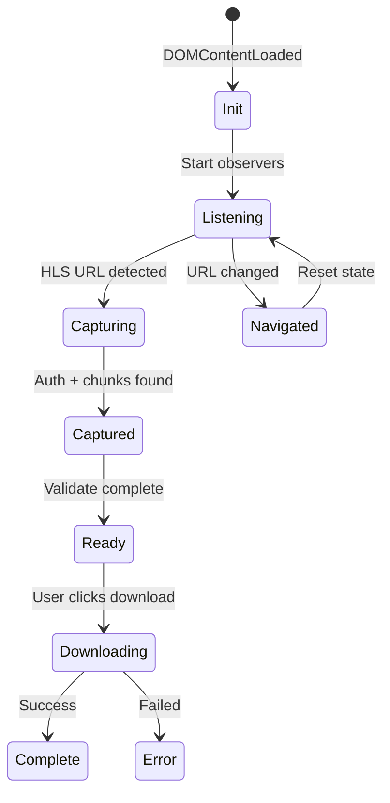

# Scaler Companion - Low Level Design (LLD)

## 1. Backend Module Design

### 1.1 VideoDownloader (`downloader.py`)

```python
class VideoDownloader:
    """Downloads HLS video chunks and processes them"""
    
    # Attributes
    output_dir: str              # Base output directory
    clips_dir: str               # Path for split clips
    chunks_dir: str              # Path for raw chunks
    clip_duration: int           # Seconds per clip
    progress_callback: Callable  # Progress reporter
    
    # Methods
    def __init__(output_dir: str = "scaler_videos", clip_duration: int = 120)
    def set_progress_callback(callback: Callable[[int, int, str], None])
    def download_chunks(base_url, start_chunk, end_chunk, key_pair_id, policy, signature) -> bool
    def merge_chunks_to_video(start_chunk, end_chunk, output_filename) -> Optional[str]
    def split_video_into_clips(video_path, output_prefix) -> List[str]
    def download_and_process(base_url, start_chunk, end_chunk, ...) -> dict
    
    # Private Methods
    def _try_download_chunk(session, base_url, chunk_num, ...) -> Tuple[bytes, dict]
    def _build_chunk_url_from_format(base_url, chunk_num, format_info, ...) -> str
    def _update_progress(current, total, message)
```

**Chunk URL Patterns Supported:**
- `data{N:06d}.ts` (standard)
- `{N:06d}.ts` (alternative)
- `data{N}.ts` (no padding)

---

### 1.2 WhisperTranscriber (`transcriber.py`)

```python
class WhisperTranscriber:
    """Transcribes audio using OpenAI Whisper"""
    
    MODELS = ["tiny", "base", "small", "medium", "large"]
    
    # Attributes
    model_name: str
    model: whisper.Whisper  # Lazy-loaded
    device: str             # "cuda", "mps", or "cpu"
    
    # Methods
    def __init__(model_name: str = "medium")
    def load_model() -> whisper.Whisper
    def extract_audio(video_path: str, output_dir: str) -> str
    def transcribe(audio_path: str, language: str = "en") -> dict
    def transcribe_video(video_path, output_dir, language) -> dict
    
    # Output Format
    {
        "text": str,           # Full transcript text
        "chunks": [
            {"start": float, "end": float, "text": str},
            ...
        ]
    }
```

**Device Selection Logic:**
```python
if torch.cuda.is_available():
    device = "cuda"
elif torch.backends.mps.is_available():
    device = "mps"  # Apple Silicon
else:
    device = "cpu"
```

---

### 1.3 FrameExtractor (`frame_extractor.py`)

```python
class FrameExtractor:
    """Extracts key frames from video based on scene changes + intervals"""
    
    # Attributes
    scene_threshold: float    # FFmpeg scene detection (0.0-1.0)
    min_interval: float       # Minimum seconds between frames
    fixed_interval: float     # Fallback interval sampling
    hash_threshold: int       # Perceptual hash difference threshold
    skip_intro: float         # Seconds to skip at start
    skip_outro: float         # Seconds to skip at end
    
    # Methods
    def __init__(
        scene_threshold: float = 0.15,
        min_interval: float = 3.0,
        fixed_interval: float = 30.0,
        hash_threshold: int = 8,
        skip_intro: float = 0.0,
        skip_outro: float = 0.0
    )
    def get_video_duration(video_path: str) -> float
    def detect_scene_changes(video_path: str) -> List[float]
    def generate_interval_timestamps(duration: float) -> List[float]
    def merge_timestamps(scene_ts, interval_ts, duration) -> List[float]
    def extract_frames_at_timestamps(video_path, output_dir, timestamps) -> List[dict]
    def remove_duplicate_frames(frames: List[dict]) -> List[dict]
    def extract_frames(video_path, output_dir, remove_duplicates=True, use_hybrid=True) -> List[dict]
    
    # Frame Info Structure
    {
        "path": str,
        "filename": str,
        "timestamp": float,
        "timestamp_display": str  # "HH:MM:SS"
    }
```

**FFmpeg Scene Detection Command:**
```bash
ffmpeg -i video.mp4 -vf "select='gt(scene,0.15)',showinfo" -f null -
```

---

### 1.4 SlideAnalyzer (`slide_analyzer.py`)

```python
class SlideAnalyzer:
    """Analyzes slide images using OCR and Vision LLM"""
    
    VISION_MODELS = [
        "llava", "llava:13b", "llava:34b",
        "llama3.2-vision", "llama3.2-vision:11b",
        "bakllava", "cogvlm"
    ]
    
    # Attributes
    vision_model: str
    ollama_host: str
    use_ocr: bool
    use_vision: bool
    ocr_engine: str           # "easyocr" or "tesseract"
    smart_vision: bool        # Skip vision for text-heavy slides
    ocr_word_threshold: int   # Words before skipping vision
    _ocr_reader: easyocr.Reader  # Lazy-loaded
    
    # Methods
    def __init__(
        vision_model: str = "llama3.2-vision:11b",
        ollama_host: str = "http://localhost:11434",
        use_ocr: bool = True,
        use_vision: bool = True,
        smart_vision: bool = True,
        ocr_word_threshold: int = 30
    )
    def extract_text_ocr(image_path: str) -> str
    def analyze_with_vision(image_path: str, ocr_text: str) -> str
    def analyze_slide(image_path: str) -> dict
    def analyze_all_slides(frames: List[dict], output_dir: str) -> List[dict]
    
    # Analysis Output
    {
        "frame_path": str,
        "timestamp": float,
        "ocr_text": str,
        "vision_analysis": str,
        "vision_skipped": bool,
        "summary": str
    }
```

---

### 1.5 NotesGenerator (`notes_generator.py`)

```python
class NotesGenerator:
    """Generates lecture notes using Ollama LLM"""
    
    PROMPTS = {
        "lecture_notes": "...",
        "summary": "...",
        "qa_cards": "...",
        "announcements": "...",
        "batch_all": "..."  # Combined prompt
    }
    
    # Attributes
    model: str
    ollama_host: str
    chunk_size: int       # Max chars per context window
    _client: ollama.Client
    
    # Methods
    def __init__(
        model: str = "gpt-oss:20b",
        ollama_host: str = "http://localhost:11434",
        chunk_size: int = 16000
    )
    def list_available_models() -> List[str]
    def check_model_available() -> bool
    def generate(transcript, prompt_type, custom_prompt=None, title="Lecture") -> str
    def generate_all(transcript, output_dir, title, use_batch=True) -> dict
    
    # Batch Output Parsing
    {
        "lecture_notes": str,
        "qa_cards": str,
        "summary": str,
        "announcements": str
    }
```

**Prompt Engineering:** Uses `## SECTION_START` / `## SECTION_END` markers for batch parsing.

---

### 1.6 ProcessingPipeline (`pipeline.py`)

```python
class ProcessingPipeline:
    """Orchestrates the complete lecture processing workflow"""
    
    # Attributes
    output_base: Path
    whisper_model: str
    ollama_model: str
    vision_model: str
    progress_callback: Callable
    _transcriber: WhisperTranscriber      # Lazy
    _frame_extractor: FrameExtractor      # Lazy
    _notes_generator: NotesGenerator      # Lazy
    _slide_analyzer: SlideAnalyzer        # Lazy
    
    # Methods
    def __init__(
        output_base: str = "output",
        whisper_model: str = "medium",
        ollama_model: str = "gpt-oss:20b",
        vision_model: str = "llama3.2-vision:11b"
    )
    def set_progress_callback(callback: Callable)
    def process(
        video_path: str,
        title: str,
        skip_transcription: bool = False,
        skip_frames: bool = False,
        skip_notes: bool = False,
        skip_slide_analysis: bool = False
    ) -> dict
    
    # Private
    def _sanitize_title(title: str) -> str
    def _create_recording_folder(title: str) -> Path
    def _create_enhanced_transcript(recording_dir, frames, slide_analyses)
    def _prepare_notes_context(transcript, frames, slide_analyses) -> str
    def _create_index_file(recording_dir, title, results)
    def _create_lecture_viewer(recording_dir, title, frames, slide_analyses)
```

---

## 2. API Data Models

### 2.1 Pydantic Models (`server.py`)

```python
class StreamInfo(BaseModel):
    baseUrl: Optional[str] = None
    streamUrl: Optional[str] = None
    keyPairId: Optional[str] = None
    policy: Optional[str] = None
    signature: Optional[str] = None
    detectedChunk: Optional[int] = None

class DownloadRequest(BaseModel):
    title: str
    url: str
    streamInfo: StreamInfo
    startTime: Optional[int] = None
    endTime: Optional[int] = None

class ProcessRequest(BaseModel):
    title: str
    videoPath: str
    options: dict = {}
    whisperModel: str = "medium"
    ollamaModel: str = "gpt-oss:20b"
    skipTranscription: bool = False
    skipFrames: bool = False
    skipNotes: bool = False
    skipSlideAnalysis: bool = False

class ProcessStatus(BaseModel):
    processId: str
    status: str  # pending|processing|complete|error
    progress: float
    stage: Optional[str] = None
    message: Optional[str] = None
    outputDir: Optional[str] = None
    error: Optional[str] = None
    title: Optional[str] = None

class DownloadStatus(BaseModel):
    downloadId: str
    status: str  # pending|downloading|complete|error
    progress: float
    message: Optional[str] = None
    path: Optional[str] = None
    error: Optional[str] = None
```

---

## 3. Extension Architecture

### 3.1 Content Script State Machine



### 3.2 Message Types

```typescript
// Content → Background
type StreamCapture = {
    action: "streamCaptured";
    data: { baseUrl, streamUrl, detectedChunk };
}

type AuthCapture = {
    action: "authCaptured";
    data: { keyPairId, policy, signature };
}

// Background → Content
type GetLecture = {
    action: "getLecture";
}

// Popup → Background
type StartDownload = {
    action: "startDownload";
    lecture: LectureInfo;
}

// Background → All
type DownloadStatus = {
    action: "downloadStatus";
    status: "downloading" | "complete" | "error";
    progress: number;
}
```

---

## 4. File System Structure

```
/Users/satish/lecture_processor/
├── extension/
│   ├── manifest.json
│   ├── popup/
│   │   ├── popup.html      # 3.8KB - UI structure
│   │   ├── popup.js        # 15KB - Logic
│   │   └── popup.css       # 8.4KB - Styles
│   ├── content/
│   │   ├── inject.js       # 28KB - Stream capture
│   │   └── inject.css      # 1.5KB - Injected styles
│   └── background/
│       └── service-worker.js  # 11KB - Background logic
│
├── backend/
│   ├── server.py           # 26KB - FastAPI app
│   ├── pipeline.py         # 35KB - Orchestrator
│   ├── downloader.py       # 19KB - HLS download
│   ├── transcriber.py      # 9KB - Whisper
│   ├── frame_extractor.py  # 15KB - FFmpeg frames
│   ├── slide_analyzer.py   # 13KB - OCR + Vision
│   ├── notes_generator.py  # 23KB - LLM prompts
│   └── requirements.txt
│
├── dashboard/
│   └── src/
│       ├── App.jsx
│       └── pages/
│           ├── HomePage.jsx      # 10KB
│           ├── QueuePage.jsx     # 9KB
│           └── RecordingPage.jsx # 10KB
│
└── output/
    ├── videos/
    │   └── {title}/
    │       ├── chunks/
    │       └── full_video.mp4
    └── YYYY-MM-DD_{title}/
        ├── video.mp4
        ├── audio.wav
        ├── transcript.{md,json,txt}
        ├── transcript_with_slides.md
        ├── lecture_notes.md
        ├── summary.md
        ├── qa_cards.md
        ├── slides/
        ├── slides_metadata.json
        ├── metadata.json
        ├── viewer.html
        └── index.md
```

---

## 5. Error Handling Patterns

### 5.1 Download Errors
```python
try:
    response = session.get(url, timeout=30)
    response.raise_for_status()
except requests.Timeout:
    # Retry with exponential backoff
except requests.HTTPError as e:
    if e.response.status_code == 403:
        # CloudFront signature expired
    elif e.response.status_code == 404:
        # End of stream reached (expected)
```

### 5.2 Processing Errors
```python
try:
    results = pipeline.process(video_path, title)
except FileNotFoundError:
    # Video missing
except torch.cuda.OutOfMemoryError:
    # Fall back to smaller model
except Exception as e:
    processes[pid].status = "error"
    processes[pid].error = str(e)
```

---

*Document Version: 1.0 | Last Updated: 2026-01-14*
