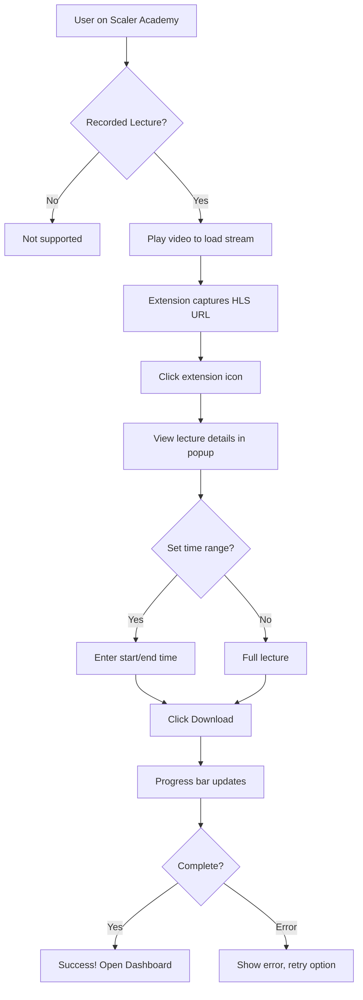
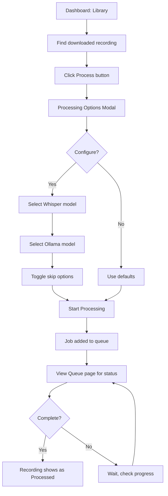
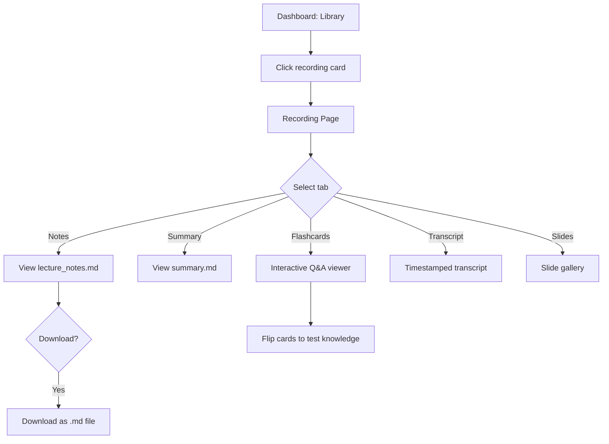
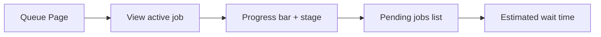
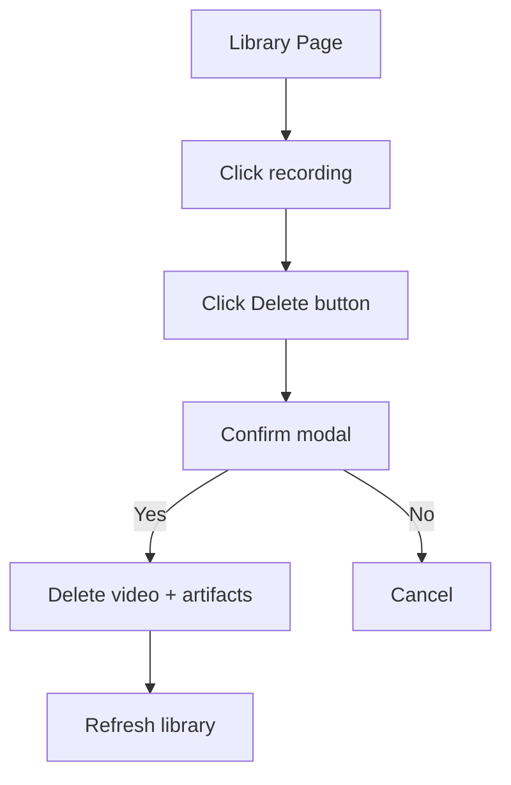
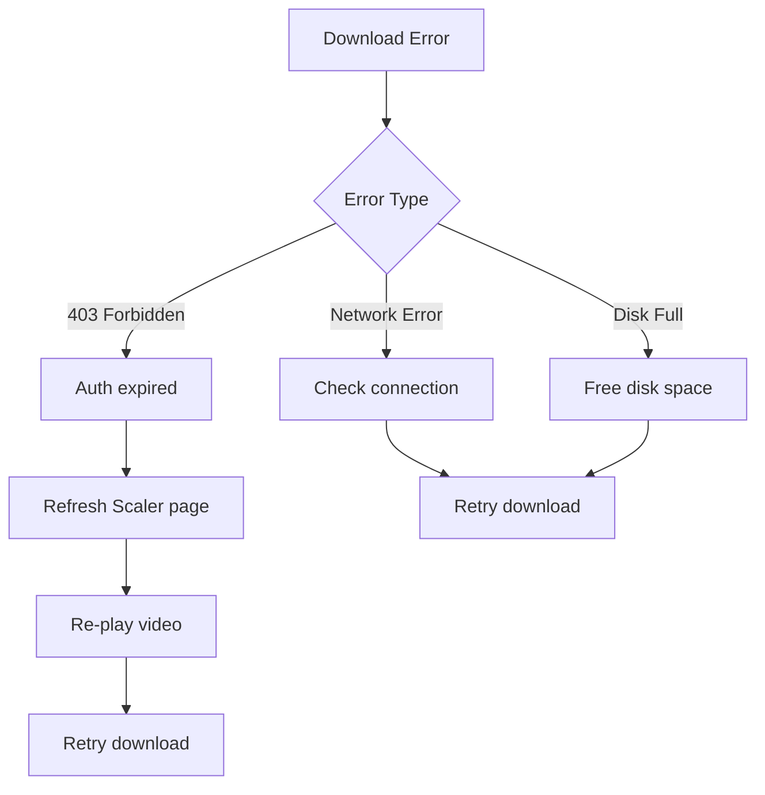
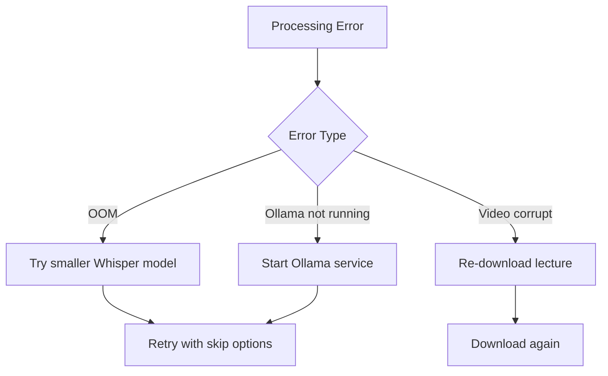

# Scaler Companion - User Flow Documentation

## 1. Overview

This document describes the primary user journeys through the Scaler Companion system.

---

## 2. Primary User Flows

### 2.1 Lecture Download Flow

**Steps:**
1. Navigate to a recorded lecture on Scaler Academy
2. **Play the video** (required to capture stream URL)
3. Click the Scaler Companion extension icon
4. Verify lecture title and stream captured
5. (Optional) Set start/end time for partial download
6. Click "Download Lecture"
7. Wait for download to complete (progress shown)
8. Click "Open Dashboard" to view/process

---

### 2.2 AI Processing Flow

**Processing Options:**
| Option | Default | Description |
|--------|---------|-------------|
| Whisper Model | `medium` | tiny/base/small/medium/large |
| Ollama Model | `gpt-oss:20b` | Any installed model |
| Skip Transcription | Off | Reuse existing transcript |
| Skip Frames | Off | Reuse existing slides |
| Skip Notes | Off | Skip LLM generation |
| Skip Slide Analysis | Off | Skip OCR/Vision |

---

### 2.3 Content Consumption Flow

**Tab Contents:**
| Tab | Content | Features |
|-----|---------|----------|
| **Notes** | Structured lecture notes | Markdown with tables |
| **Summary** | 4-5 paragraph overview | Key concepts |
| **Flashcards** | Q&A cards | Interactive flip |
| **Transcript** | Timestamped text | With embedded slides |
| **Slides** | Extracted frames | Gallery view |

---

## 3. Secondary Flows

### 3.1 Queue Monitoring Flow

### 3.2 Recording Deletion Flow

---

## 4. User Interface States

### 4.1 Extension Popup States

| State | Visual | User Action |
|-------|--------|-------------|
| **Backend Offline** | Red banner | Start backend |
| **No Lecture** | "Navigate to a lecture" | Go to Scaler |
| **Play Required** | "Play video first" | Click play |
| **Ready** | Title + Download button | Download |
| **Downloading** | Progress bar | Wait |
| **Complete** | Green checkmark | Open Dashboard |
| **Error** | Red error text | Retry |

### 4.2 Dashboard States

| Page | Loading | Empty | Data |
|------|---------|-------|------|
| **Library** | Spinner | "No recordings yet" | Grid of cards |
| **Queue** | Spinner | "Queue is empty" | Job list |
| **Recording** | Spinner | "Not found" | Tabs + content |

---

## 5. Error Recovery Flows

### 5.1 Download Error Recovery

### 5.2 Processing Error Recovery

---

## 6. Keyboard Shortcuts (Planned V2)

| Shortcut | Action |
|----------|--------|
| `Cmd+D` | Download current lecture |
| `Cmd+O` | Open dashboard |
| `Left/Right` | Navigate flashcards |
| `Space` | Flip flashcard |
| `/` | Search recordings |

---

*Document Version: 1.0 | Last Updated: 2026-01-14*
